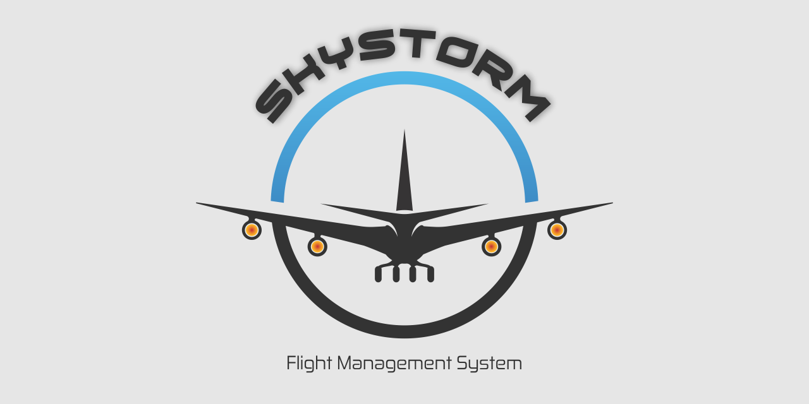

# SkyStorm Flight Management Software (Project #1)

An airline flight management web app that allows you to view, add, update, and delete flight data built using the MERN stack (MongoDB, Express, React, Node). Image created with CorelDraw (vector image creation program).

To get started, enter the following in the console:
>npm run server (server)
>npm start (front end)
